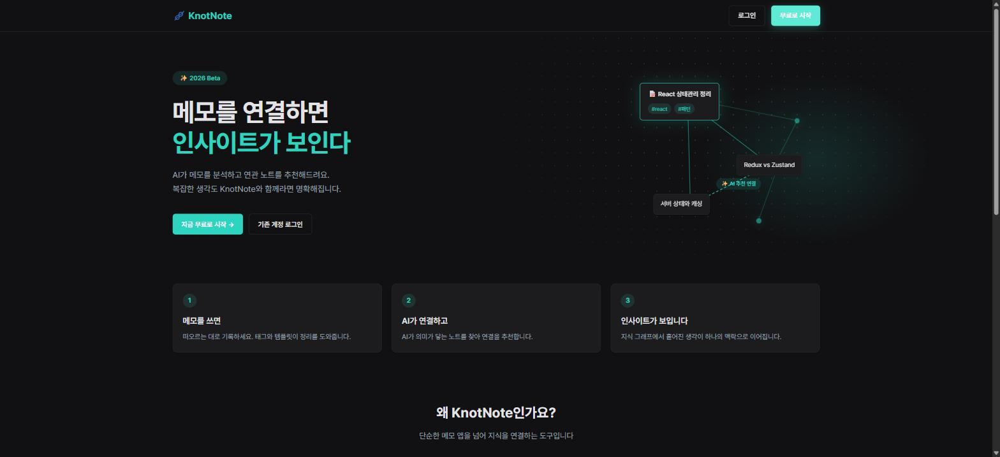
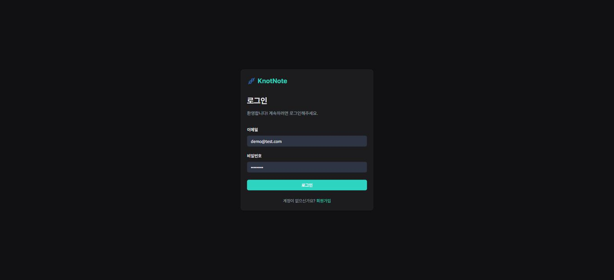
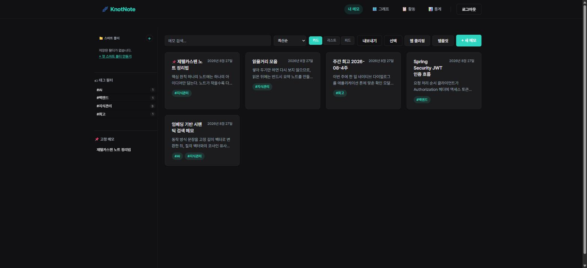
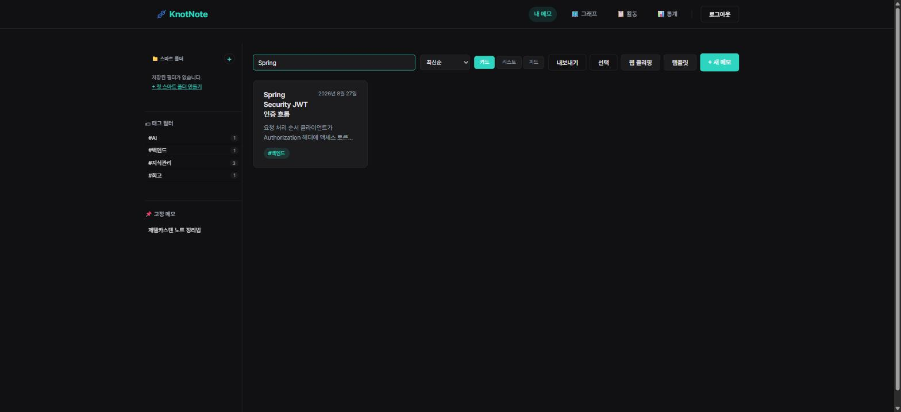
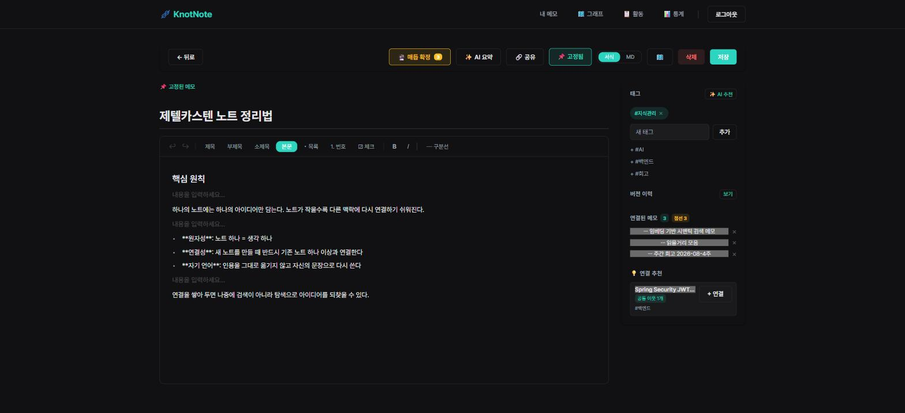
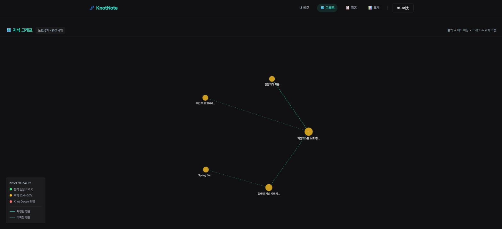
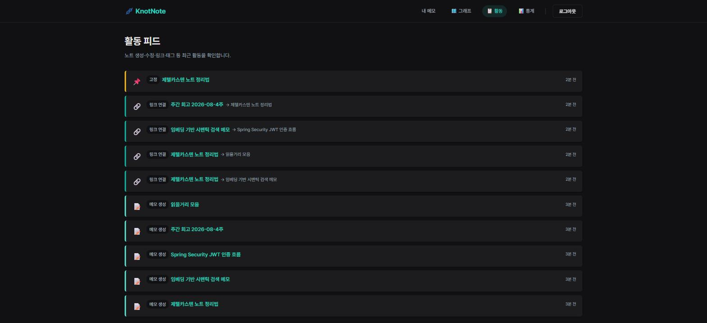
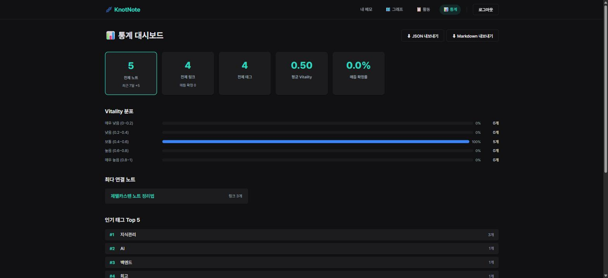
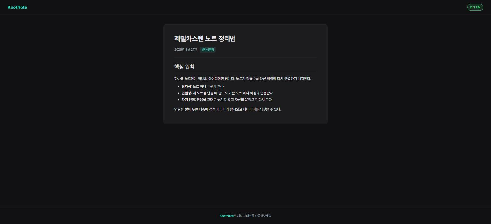

# KnotNote 사용 가이드

KnotNote 는 메모를 작성하고 메모끼리 연결하여, 흩어진 기록을 하나의 지식 그래프로 엮어 주는 서비스입니다. 이 문서는 실행 중인 애플리케이션의 화면을 따라가며 각 기능을 어떻게 사용하는지 설명합니다.

실행 방법은 [README](../README.md#실행-방법) 를 참고해 주세요. 아래 화면은 모두 로컬 개발 환경(프론트엔드 `http://localhost:3000`)에서 촬영했습니다.

---

## 1. 시작하기

첫 화면에서는 서비스의 개념을 소개합니다. 계정이 없다면 **지금 무료로 시작**을 눌러 회원가입하고, 이미 계정이 있다면 **기존 계정 로그인**으로 이동합니다.

로그인은 이메일과 비밀번호로 진행합니다. 비밀번호는 8자 이상이어야 하며, 로그인에 성공하면 액세스 토큰이 발급되어 이후 모든 요청의 인증에 사용됩니다. 액세스 토큰이 만료되면 리프레시 토큰으로 자동 재발급되므로 사용 중에 다시 로그인할 필요는 없습니다.

---

## 2. 대시보드에서 메모 관리하기

로그인하면 대시보드로 이동합니다. 화면은 크게 왼쪽의 필터 영역과 오른쪽의 메모 목록으로 나뉩니다.

### 왼쪽 영역

| 구역 | 설명 |
| --- | --- |
| 스마트 폴더 | 검색어와 태그 조건을 저장해 두고 한 번의 클릭으로 다시 불러오는 기능입니다. |
| 태그 필터 | 태그를 클릭하면 해당 태그가 달린 메모만 목록에 표시됩니다. 오른쪽 숫자는 그 태그가 달린 메모 수입니다. |
| 고정 메모 | 상단에 고정해 둔 메모를 모아 보여 줍니다. |

### 오른쪽 영역

상단 도구 모음에서 다음 작업을 수행합니다.

- **정렬**: 최신순, 오래된순, 제목 가나다순, 제목 역순 중에서 선택합니다.
- **보기 방식**: 카드, 리스트, 피드 세 가지 형태로 목록을 전환합니다.
- **내보내기**: 전체 메모를 Markdown 파일들로 묶어 ZIP 으로 내려받습니다.
- **선택**: 여러 메모를 한 번에 고른 뒤 일괄 삭제하거나 태그를 붙입니다.
- **웹 클리핑**: URL 을 입력하면 그 페이지의 내용을 가져와 새 메모로 만듭니다.
- **템플릿**: 미리 정의된 서식에서 새 메모를 시작합니다.
- **+ 새 메모**: 빈 편집기를 엽니다.

### 검색

상단 검색창에 단어를 입력하면 제목과 본문을 대상으로 검색이 실행됩니다. 입력이 멈춘 뒤 잠시 기다렸다가 요청이 나가므로(디바운스), 타이핑 도중에 결과가 계속 바뀌지는 않습니다.

---

## 3. 메모 작성과 연결

메모를 클릭하면 편집기가 열립니다. 이 화면이 KnotNote 의 중심입니다.

### 상단 도구 모음

| 버튼 | 하는 일 |
| --- | --- |
| 매듭 확정 | 아직 확정하지 않은 연결을 검토하여 확정 상태로 바꿉니다. 옆의 숫자는 검토 대기 중인 연결 수입니다. |
| AI 요약 | 본문을 요약합니다. `OPENAI_API_KEY` 가 설정되어 있어야 동작합니다. |
| 공유 | 읽기 전용 공유 링크를 발급합니다. |
| 고정 | 메모를 고정 목록에 올리거나 내립니다. |
| 서식 / MD | 서식 편집기와 Markdown 원문 편집기를 전환합니다. |
| 저장 / 삭제 | 변경 내용을 저장하거나 메모를 삭제합니다. |

### 오른쪽 사이드바

- **태그**: 새 태그를 직접 입력해 추가하거나, 이미 만들어 둔 태그를 클릭해 붙입니다. **AI 추천**을 누르면 본문을 분석해 어울리는 태그를 제안합니다.
- **버전 이력**: 저장할 때마다 이전 판이 보관되며, **보기**를 눌러 확인하고 원하는 시점으로 되돌릴 수 있습니다.
- **연결된 메모**: 이 메모와 이어진 메모의 목록입니다. 옆의 **점선** 표시는 아직 확정하지 않은 연결이라는 뜻입니다.
- **연결 추천**: 함께 연결된 이웃 메모가 겹치는 정도를 근거로 다음에 이을 만한 메모를 제안합니다. **+ 연결**을 누르면 바로 이어집니다.

> 연결을 만들 때 그 연결을 만드는 이유를 함께 적어 두면, 나중에 그래프를 되짚을 때 맥락을 복원하기 쉬워집니다.

---

## 4. 지식 그래프로 전체 구조 보기

**그래프** 메뉴에서는 메모 전체와 그 연결을 한 화면에 펼쳐 봅니다.

- 원 하나가 메모 하나이고, 원의 크기는 연결이 많을수록 커집니다.
- 원의 색은 **Knot Vitality**, 즉 그 메모가 얼마나 활발하게 유지되고 있는지를 나타냅니다. 초록은 활력이 높은 상태(0.7 이상), 노랑은 주의가 필요한 상태(0.4~0.7), 빨강은 연결이 약해져 방치되고 있는 상태입니다.
- 실선은 확정된 연결이고, 점선은 아직 확정하지 않은 연결입니다.
- 원을 클릭하면 해당 메모로 이동하고, 끌어서 위치를 조정할 수 있습니다.

---

## 5. 활동 피드로 되짚어 보기

메모 생성, 수정, 연결, 태그 부착, 고정 등 최근에 일어난 변경을 시간 순서대로 보여 줍니다. 며칠 만에 다시 들어왔을 때 어디까지 작업했는지 확인하는 용도로 적합합니다.

---

## 6. 통계와 내보내기

축적된 기록을 수치로 확인합니다.

- **요약 지표**: 전체 노트 수, 전체 링크 수, 전체 태그 수, 평균 Vitality, 매듭 확정률을 보여 줍니다.
- **Vitality 분포**: 활력 구간별로 메모가 몇 개씩 분포하는지 나타냅니다. 낮은 구간에 메모가 몰려 있다면 연결을 보강할 시점입니다.
- **최다 연결 노트**: 가장 많은 메모와 이어진 메모입니다. 지식 구조의 중심 역할을 하는 메모라고 볼 수 있습니다.
- **인기 태그 Top 5**: 가장 자주 사용한 태그입니다.

오른쪽 위의 **JSON 내보내기**와 **Markdown 내보내기**로 전체 데이터를 파일로 저장할 수 있습니다.

---

## 7. 메모 공유하기

편집기에서 **공유**를 누르면 `/shared/{토큰}` 형식의 링크가 발급됩니다. 이 링크를 받은 사람은 로그인하지 않고도 해당 메모를 읽을 수 있으며, 편집은 할 수 없습니다. 공유를 중단하려면 편집기에서 공유를 다시 해제합니다.

---

## 8. 빠른 기록 (Quick Capture)

로그인한 상태에서는 어느 화면에 있든 빠른 기록 창을 띄워 즉시 메모를 남길 수 있습니다. 떠오른 생각을 놓치지 않고 적어 둔 뒤, 나중에 대시보드에서 정리하고 연결하는 방식으로 사용합니다.

---

## 권장 사용 흐름

1. 떠오르는 대로 짧게 메모를 남깁니다. 처음부터 잘 정리하려 애쓰지 않아도 됩니다.
2. 메모를 다시 열었을 때 **연결 추천**을 확인하고, 관련 있는 메모와 이어 둡니다.
3. 이어 둔 연결 중 확신이 생긴 것은 **매듭 확정**으로 확정합니다.
4. 주기적으로 **그래프**를 열어 활력이 낮아진 메모를 찾아 보완하거나 연결을 추가합니다.
5. 정리된 결과는 **통계**에서 확인하고, 필요하면 Markdown 으로 내보냅니다.

---

## 참고 사항

- `OPENAI_API_KEY` 를 설정하지 않으면 AI 요약과 태그 추천이 동작하지 않습니다. 나머지 기능은 정상적으로 사용할 수 있습니다.
- 임베딩 서버(`embed_server/`, 기본 포트 8000)를 실행하지 않으면 의미 기반 검색이 비활성화되고, 키워드 검색만 동작합니다.
- API 명세는 백엔드 실행 후 Swagger UI(`http://localhost:8080/swagger-ui.html`)에서 확인할 수 있습니다.
